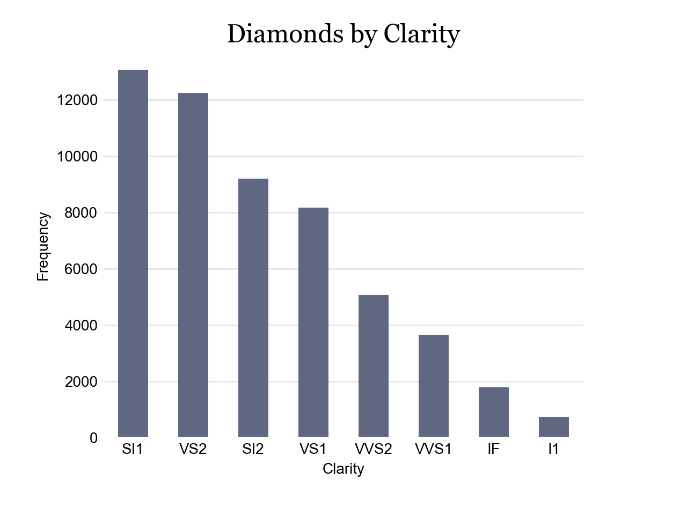

# Introduction

Standard MassMutual visualization theme built for matplotlib.

# Styles Installation

```bash
cd {path_to_project}/mmviz-python
pip install -r requirements.txt
python install.py
```

# Example
```python
import matplotlib.pyplot as plt
import pandas as pd

import mmviz

plt.style.use("mmviz")
mmviz.scale_fill_mm()

df = pd.read_csv("./examples/data/diamonds.csv")
df1 = df.groupby('clarity').size()
df1.sort_values(ascending=False, inplace=True)

ax = df1.plot.bar(rot=0)
ax.set_title("Diamonds by Clarity")
mmviz.theme_mm(ax, "bar")

plt.xlabel("Clarity")
plt.ylabel("Frequency")

plt.show()
```

The resulting chart will look like this: 



# Available Functions

## [mmviz.py]
* theme_mm(ax, chart_type = "default")
* scale_color_mm(type = "qual")
* scale_fill_mm(type="qual")
* create_bin_list(values, binwidth)
* place_legend(plt, title, width = 0.2)
